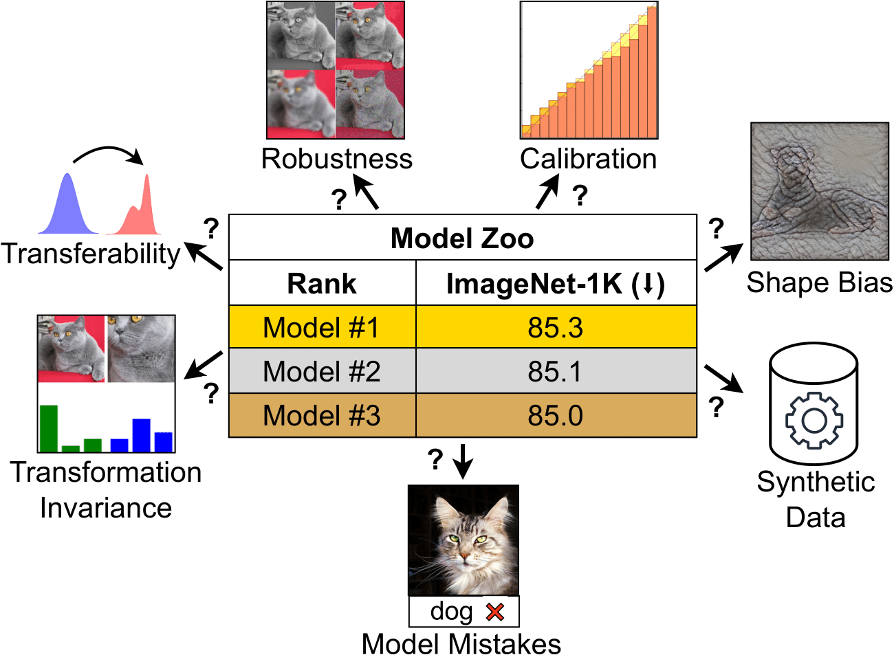

# ConvNet vs Transformer, Supervised vs CLIP: Beyond ImageNet Accuracy

### [Paper](https://arxiv.org/abs/2311.09215) | [Project Page](https://kirill-vish.github.io/beyond-imagenet-accuracy/) | [Twitter](https://x.com/liuzhuang1234/status/1744471159901401151?s=20)

>[ConvNet vs Transformer, Supervised vs CLIP: Beyond ImageNet Accuracy](https://arxiv.org/abs/2311.09215)

[Kirill Vishniakov¹](https://kirill-vish.github.io/), [Zhiqiang Shen¹](https://zhiqiangshen.com/), [Zhuang Liu²](https://liuzhuang13.github.io/)

[¹MBZUAI](https://mbzuai.ac.ae/), [²Meta AI Research](https://ai.meta.com/)


<p float="left">
  
  
</p>

## Overview

<p align="center">

</p>

> **Abstract:** Modern computer vision offers a great variety of models to practitioners, and selecting a model from multiple options for specific applications can be challenging. Conventionally, competing model architectures and training protocols are compared by their classification accuracy on ImageNet. However, this single metric does not fully capture performance nuances critical for specialized tasks. In this work, we conduct an in-depth comparative analysis of model behaviors beyond ImageNet accuracy, for both ConvNet and Vision Transformer architectures, each across supervised and CLIP training paradigms. Although our selected models have similar ImageNet accuracies and compute requirements, we find that they differ in many other aspects: types of mistakes, output calibration, transferability, and feature invariance, among others. This diversity in model characteristics, not captured by traditional metrics, highlights the need for more nuanced analysis when choosing among different models.


## How to use this repo

This repository provides the necessary code and resources to reproduce the experiments detailed in our paper.

**Inference Code** is located within the `inference` folder, containing functionality for various evaluations like calibration, ImageNet-X, PUG-ImageNet, robustness, shape/texture bias and transformation invariance.

There are several **Entry Points** to run experiments:
  - `main.py`: Main script to run experiments. Using this script you can run experiments for robustness, ImageNet-X, invariance, PUG-ImageNet.
  - `inference/calibration.py`: Script for model calibration evaluation.
  - `inference/shape_texture.py`: Script for analyzing shape and texture biases.

`models` folder contains the model implementations. For supervised models we use [Deit3-B/16](https://github.com/facebookresearch/deit/blob/main/README_revenge.md) and [ConvNext-B](https://github.com/facebookresearch/ConvNeXt) both pretrained on ImageNet-21K and finetuned on ImageNet-1K, and take implementations from their original repos. Their checkpoints can be acquired at the respective links:
- [DeiT-3 checkpoint](https://dl.fbaipublicfiles.com/deit/deit_3_base_224_21k.pth)
- [ConvNeXt supervised checkpoint](https://dl.fbaipublicfiles.com/convnext/convnext_base_22k_1k_224.pth)

For CLIP models we use models the following models from [OpenCLIP](https://github.com/mlfoundations/open_clip):
- ConvNeXt-CLIP: `convnext_base`, pretrained: `laion400m_s13b_b51k`
- ViT-CLIP:  `ViT-B-16`, pretrained: `laion400m_e31`


## Inference

Here we provide several examples on how to utilize the provided scripts to run various evaluations.

By default the following values are supported for the `--model` argument: `deit3_21k`, `convnext_base_21k`, `vit_clip`, `convnext_clip`.


### Using `main.py`:

1. **Robustness Evaluation**:
    In this case `$data_path` should be pointing to the folder where easyrobust downloaded all the benchmarks.
    ```bash
    python3 main.py --model "deit3_21k" --experiment "robustness" --data_path $data_path
    ```

2. **ImageNet-X Evaluation**:
    ```bash
    python3 main.py --model "deit3_21k" --experiment "imagenet_x" --data_path $ImageNet_Val_path
    ```

3. **Invariance Evaluation**:
    ```bash
    python3 main.py --model "deit3_21k" --experiment "invariance" --data_path $ImageNet_Val_path
    ```

4. **PUG-ImageNet Evaluation**:
    ```bash
    python3 main.py --model "deit3_21k" --experiment "pug_imagenet" --data_path $PUG_ImageNet_path
    ```

### Using `inference/calibration.py`:

- **Model Calibration Evaluation**:
   In this case `$data_path` should be pointing either to ImageNet validation or ImageNet-R.
    ```bash
    python3 inference/calibration.py \
        --model "deit3_21k" \
        --data_path $data_path
    ```

### Using `inference/shape_texture.py`:

- **Shape and Texture Bias Analysis**:
    ```bash
    python3 inference/shape_texture.py
    ```

## Installation

1. Clone the repository:
    ```bash
    git clone https://github.com/kirill-vish/Beyond-INet.git
    ```

2. Navigate to the project directory:
    ```bash
    cd Beyond-INet
    ```

3. Create a new Conda environment and activate it:
    ```bash
    conda create --name beyond_imagenet python=3.10
    conda activate beyond_imagenet
    ```

4. Install the required packages:
    ```bash
    pip install -r requirements.txt
    ```

5. Install the package:
    ```bash
    python setup.py install
    ```


## Contact

Kirill Vishniakov ki.vishniakov at gmail.com

## Acknowledgements

[EasyRobust](https://github.com/alibaba/easyrobust)

[Calibration library](https://github.com/Jonathan-Pearce/calibration_library)

[ImageNet-X](https://facebookresearch.github.io/imagenetx/site/home)

[PUG-ImageNet](https://github.com/facebookresearch/PUG/tree/main/PUG_ImageNet)

## Citation

If you found our work useful, please consider citing us.

```
@article{vishniakov2023convnet,
      title={ConvNet vs Transformer, Supervised vs CLIP: Beyond ImageNet Accuracy}, 
      author={Kirill Vishniakov and Zhiqiang Shen and Zhuang Liu},
      year={2023},
      eprint={2311.09215},
      archivePrefix={arXiv},
      primaryClass={cs.CV}
}
```

## License

This repository is licensed under MIT License.
